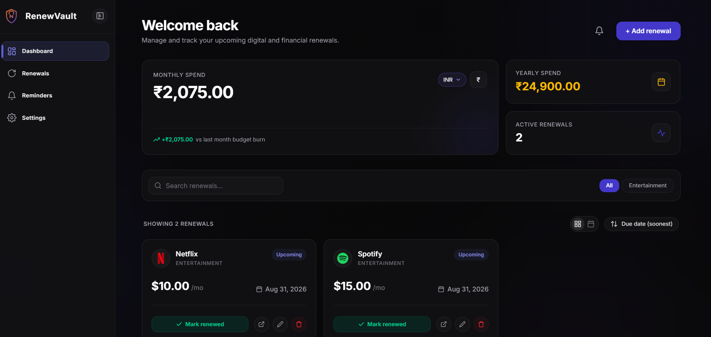

# RenewVault

RenewVault is a full-stack subscription and renewal tracking web application. It helps users keep track of recurring subscriptions, upcoming renewals, and reminders — all in one clean, responsive dashboard.

## Preview : https://www.renewvault.me/
**Entry Page**


**Sign In**


**Sign Up**


**Dashboard**



## Features

- **Dashboard overview** — welcome summary, filterable and sortable list of active renewals with live per-status counts on each filter chip
- **Multi-currency spending summary** — view monthly and yearly spend converted across INR, USD, EUR, and GBP
- **Renewal cards** — status-colored indicators (active, due soon, expired) with quick actions and accessible, touch-friendly controls
- **Empty states** — clear guidance shown when there are no renewals yet or a search/filter returns no matches
- **Mobile-first navigation** — dedicated top bar and bottom tab navigation for small screens, alongside a collapsible sidebar on desktop
- **Reminders** — automated notifications for upcoming renewal dates via scheduled cron jobs
- **Settings** — manage account and notification preferences
- **Auth** — secure sign-in/sign-up flow

## Tech Stack

**Frontend**
- [Next.js 16](https://nextjs.org/) (App Router)
- [React 19](https://react.dev/)
- [TypeScript](https://www.typescriptlang.org/)
- [Tailwind CSS v4](https://tailwindcss.com/) with a custom CSS variable–based design token system

**Backend**
- Next.js API routes (Node.js)
- [PostgreSQL](https://www.postgresql.org/) via `pg`
- [Prisma ORM](https://www.prisma.io/) (`@prisma/client`, `@prisma/adapter-pg`)
- [Auth.js / NextAuth v5](https://authjs.dev/) with `@auth/prisma-adapter` for authentication
- [bcryptjs](https://www.npmjs.com/package/bcryptjs) for password hashing
- [Resend](https://resend.com/) for transactional/reminder emails
- [Vercel Blob](https://vercel.com/docs/storage/vercel-blob) for file storage
- Cron-based scheduled jobs for reminder notifications

## Project Structure

```
renewvault/
├── app/
│   ├── dashboard/
│   │   ├── page.tsx
│   │   ├── layout.tsx
│   │   ├── renewals/
│   │   ├── reminders/
│   │   └── settings/
│   ├── components/
│   │   └── dashboard/
│   ├── icon.svg
│   └── globals.css
├── lib/
│   ├── types.ts        # Shared types (frontend + backend)
│   ├── currency.ts      # Shared currency conversion utility
│   ├── mock-data.ts     # Frontend-only mock data
│   └── prisma.ts        # Backend database client
├── prisma/
│   └── schema.prisma    # Database schema
├── public/
│   └── screenshots/
└── README.md
```

## Getting Started

### Prerequisites

- Node.js 20+
- npm
- A PostgreSQL database (local or hosted, e.g. Neon, Supabase, Vercel Postgres)
- A `.env` file with the required environment variables

### Installation

```bash
git clone https://github.com/Alfee123-web/renewvault.git
cd renewvault
npm install
```

`npm install` automatically runs `prisma generate` via the `postinstall` script.

### Environment Variables

Create a `.env` file in the project root with the following:

```
# Database
DATABASE_URL=

# Auth.js / NextAuth
AUTH_SECRET=
NEXTAUTH_URL=

# Email (Resend)
RESEND_API_KEY=

# File storage (Vercel Blob)
BLOB_READ_WRITE_TOKEN=
```

> Reach out to a project maintainer for actual values — never commit real credentials.

### Database Setup

```bash
npx prisma migrate dev
npx prisma generate
```

Use `npx prisma studio` to browse and edit data locally.

### Running Locally

```bash
npm run dev
```

The app will be available at `http://localhost:3000`.

### Other Scripts

```bash
npm run build   # Production build
npm run start   # Start production server
npm run lint    # Run ESLint
```

## Design System

RenewVault uses a CSS custom properties–based token system defined in `globals.css`, anchored around:

- Background: `#0B0B0E`
- Accent (Indigo): `#4F46E5`
- Gradient: Ember (`#F0873E`) → Lilac (`#A879E8`)

All new components should use existing tokens (`--bg`, `--surface`, `--accent`, `--border`, `--text-primary`, `--text-muted`, `--radius-lg`) rather than hardcoded values.

## Contributing

This project is developed collaboratively with scoped ownership:

- **Frontend/UI** — dashboard screens, layout, components, styling
- **Backend** — database, auth, middleware, API routes, cron jobs

### Branching & PRs

1. Create a feature branch off `main`
2. Keep PRs scoped to your area (frontend or backend) where possible
3. Coordinate on shared files like `lib/types.ts` before renaming or removing types — additions are generally safe
4. Write clear PR descriptions with a scope statement (what was touched, what wasn't)

```bash
git checkout main
git pull origin main
git checkout -b feature/your-feature-name
```

## API Endpoints (Backend)

| Method | Endpoint | Description |
|--------|----------|-------------|
| GET | `/api/renewals` | Fetch all renewals |
| POST | `/api/renewals` | Create a new renewal |
| PATCH | `/api/renewals/:id` | Update a renewal |
| DELETE | `/api/renewals/:id` | Delete a renewal |
| GET | `/api/dashboard/stats` | Fetch dashboard summary stats |

## Roadmap

- [ ] Live exchange rate API integration (currently static rates)
- [ ] Additional dashboard features (see project mind map)

## Contributors

- [Alfee123-web](https://github.com/Alfee123-web) — Frontend / UI
- [akshat1602](https://github.com/akshat1602) — Backend / Auth / Database
